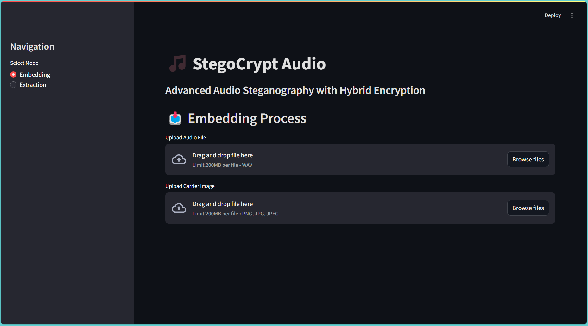

# 🎵 SonicStegnoVault


Advanced Audio Steganography with Hybrid Encryption - A secure way to hide audio data within images using AES and RSA encryption.


## 📋 Table of Contents
- [Features](#-features)
- [Technical Architecture](#-technical-architecture)
- [Installation](#-installation)
- [Usage](#-usage)
- [Screenshots](#-screenshots)
- [Technologies Used](#-technologies-used)
- [Contributing](#-contributing)
- [License](#-license)
- [Contact](#-contact)

## ✨ Features
- 🔒 Hybrid encryption using AES-128 and RSA-2048
- 🎨 LSB steganography for data embedding
- 📊 Real-time audio visualization
- 📈 Advanced audio analysis tools
- 🔍 Detailed audio feature extraction
- 📱 Responsive web interface
- 🛡️ Secure key management

## 🏗️ Technical Architecture
```ascii
┌──────────────────┐     ┌──────────────────┐     ┌──────────────────┐
│    Audio Input   │────▶│ AES Encryption   │────▶│  RSA Encryption  │
└──────────────────┘     └──────────────────┘     └──────────────────┘
         ▲                                                  │
         │                                                  ▼
┌──────────────────┐     ┌──────────────────┐     ┌──────────────────┐
│   Audio Output   │◀────│  AES Decryption  │◀────│  Image Carrier   │
└──────────────────┘     └──────────────────┘     └──────────────────┘
```

## 🚀 Installation

1. Clone the repository:
```bash
git clone https://github.com/nitinprajwal/SonicStegnoVault.git
```
```bash
cd SonicStegnoVault
```

2. Install dependencies:
```bash
pip install -r requirements.txt
```

3. Run the application:
```bash
streamlit run app.py
```

## 🎮 Usage

### Embedding Process:
1. Upload your audio file (.wav format)
2. Select a carrier image (.png format)
3. Click "Embed Audio" to start the process
4. Download the stego image and encryption keys

### Extraction Process:
1. Upload the stego image
2. Provide the private key
3. Extract and analyze the hidden audio

## 📸 Screenshots

### Embedding Interface


### Audio Analysis
[Visualisation.webm](https://github.com/user-attachments/assets/8eed8b96-2fe3-469e-87cc-bd1cbdfc4d47)

### Embedded Image


### Extraction Results
🔊 [Download Decrypted Audio](./blob/decrypted_audio.wav)

> Note: Audio file preview is not supported in markdown. Click the link above to download and play the audio file.

## 🛠️ Technologies Used

- Python 3.8+
- Streamlit
- NumPy
- Librosa
- Plotly
- Pillow
- PyCryptodome
- RSA

## 🤝 Contributing

1. Fork the repository
2. Create your feature branch (`git checkout -b feature/amazing-feature`)
3. Commit your changes (`git commit -m 'Add some amazing feature'`)
4. Push to the branch (`git push origin feature/amazing-feature`)
5. Open a Pull Request

## 🚀 Deployment

This app is automatically deployed to Streamlit Cloud via GitHub Actions. You can view the live app at:
https://sonicstegnovault.streamlit.app

[](https://sonicstegnovault.streamlit.app)

## 📄 License

Distributed under the MIT License. See `LICENSE` for more information.

## 📫 Contact

Nitin Prajwal R - [@nitinprajwalr](https://x.com/nitinprajwalr)

Project Link: [https://github.com/nitinprajwal/SonicStegnoVault](https://github.com/nitinprajwal/SonicStegnoVault)

## 🙏 Acknowledgments

- [Librosa Documentation](https://librosa.org/)
- [Streamlit Documentation](https://docs.streamlit.io/)
- [RSA Documentation](https://stuvel.eu/python-rsa-doc/)
